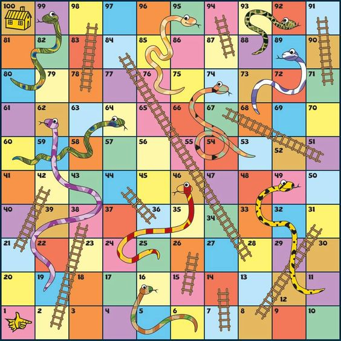

# My Ways Of Breaking Challenges Down To Simple Problems
Here contains how i solved the problem by chopping it down to different small pieces and the methods I used to to solve this challenge.

I noticed that taking time to actually do this would help to set focus on a particular section, help saves time during build and leads to a more structured code.

## **Title:** *Snakes And Ladders*
## **Question:** 

**Introduction**

Snakes and Ladders is an ancient Indian board game regarded today as a worldwide classic. It is played by two or more players on a game board with numbered, gridded squares. A number of "ladders" and "snakes" are pictured on the board, each connecting two specific squares. (Source: Wikipedia)

**Task**

Your task is to create a simple class called SnakesLadders. The test cases will call the method play(die1, die2) independently of the state of the game or the player turn. The arguments die1 and die2 are the dice thrown in a turn and are both integers between 1 and 6. The player will move by the sum of die1 and die2.

**The Board**

**Rules**
- There are two players, and both start off the board on square 0.
- Player 1 starts and alternates with player 2.
- You follow the numbers up the board in order from 1 to 100.
- If the values of both dice are the same, that player will have another turn.
- Climb up ladders. The ladders on the game board allow you to move upwards and get ahead faster. If you land exactly on a square that shows the bottom of a ladder, you may move the player all the way up to the square at the top of the ladder (even if you roll a double).
- Slide down snakes. Snakes move you back on the board. If you land exactly on the top of a snake, you must slide all the way down to the square at the bottom of the snake or chute (even if you roll a double).
- Land exactly on the last square to win. The first player to reach the highest square on the board wins. However, if you roll too high, your player "bounces" off the last square and moves back. You can only win by rolling the exact number needed to land on the last square. For example, if you are on square 98 and roll a five, move your piece to 100 (two moves), then "bounce" back to 99, 98, and 97 (three, four, then five moves).
- If the player rolls a double and lands on the finish square (100) without any remaining moves, the player wins the game and does not take another turn.
- Returns
- Return "Player n Wins!" where n is the winning player who has landed on square 100 without any remaining moves left.
- Return "Game over!" if a move is attempted after any player has won.
- Otherwise, return "Player n is on square x", where n is the current player and x is the square they are currently on.

## **Breaking Down:** 

- **Step-1:** *Things i will be storing*. I will create a struct to store some informations, edit as the game progressess and also restart back to default as for a new game.
*Informations the struct will contain:*
    - map of player 1 details
    - map of player 2 details
    - player 1 turn; either true or false, will determine who to play. But player 1 should always start from true in every new game
    - dice: a slice of die1 and die2 value
    - winner; this is going to be the name of the winner i.e player 1 or player 2
    - The squares in which each players should drop; a slice of square of snakes
    - The square where each players should be promoted; a slice of ladders
*Informations each players map will conatain*
    - name
    - The current square position

- *Step-2:* create a condition that will start the game with player 1 as the first person to take the turn.

- *Step-3:* IF player plays a certain number from the dice roll, the number should be added to the current square position on the players map, which is initally zero.

- *step-4:* Check for IF a player's die1 and die2, both show the same number. IF they show the same num, the player turn should still remain true i.e if player1 plays 3 on die1 and also 3 on die2, then they have the previledge to play again

- *Step-5:* I will check for if player get to any square of promotion or demotion, so as to add it to their current square position.

- *Step-6:* Check for the bounce rule. If a player's new position exceeds 100, calculate the overflow and bounce back. E.g., on square 98, rolls 5 → goes to 100 (2 moves), then bounces back 3 more → lands on 97.

- *Step-7:* Check for a winner. If after all movements (ladders/snakes/bounces) the player is exactly on square 100, set the winner field and return "Player n Wins!".

- *Step-8:* Check for "Game over!" at the very start of every play() call — if a winner already exists, immediately return "Game over!".

- *Step-9:* Switch turns. If the dice were NOT doubles, flip player1Turn to give the other player their go. If doubles, keep the same player's turn.

- *Step-10:* Return the result string "Player n is on square x" for a non-winning move.
